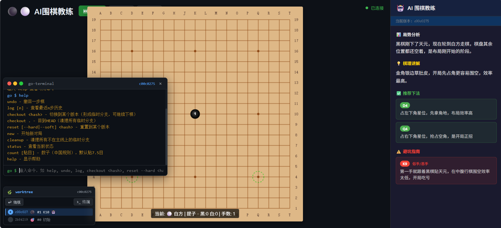

# AI围棋教练 - 项目交接文档



## 一、项目概述

这是一个**AI实时指导的围棋游戏**，核心功能包括：
- 标准19路围棋棋盘
- AI教练实时分析局势、提供棋理指导
- Git-like版本管理系统（可撤回、checkout历史、临时分支）
- 支持多人联机操作同一个对局
- 对局导出/导入功能

### 联机机制说明

**核心概念：无所谓玩家、房主，任何人都可以操作整个对局。**

- 所有客户端连接到同一个服务器房间（默认房间名：`default`）
- 每个客户端可以：
  - 落子（黑白交替自动处理）
  - 悔棋（右键或按钮）
  - 切换到任意历史版本（checkout）
  - 导出/导入对局
  - 执行终端命令（undo, reset, checkout, new 等）
- **任何一个客户端的操作，会通过Socket.io实时同步到所有其他客户端**
- **没有玩家阵营的概念**：一个人可以黑白都下，两个人也可以都操作黑白任意一方
- 这种设计适合：自我复盘、AI指导棋、多人协作推演

## 二、技术架构

```
go-game/
├── server/                    # Node.js 后端
│   ├── index.js              # Express API + Socket.io 服务器
│   ├── goEngine.js          # 围棋规则引擎
│   ├── versionManager.js     # Git-like版本管理
│   ├── aiService.js         # 豆包LLM调用
│   ├── .env                 # 环境变量配置
│   └── package.json
└── client/                   # React + Vite 前端
    ├── src/
    │   ├── App.jsx          # 主应用
    │   └── components/
    │       ├── GoBoard.jsx   # 棋盘Canvas
    │       ├── AISidebar.jsx # AI教练侧边栏
    │       ├── WorkTree.jsx  # 历史树面板
    │       └── Terminal.jsx  # 命令行终端
    └── package.json
```

### 技术栈

| 层级 | 技术 | 说明 |
|------|------|------|
| 后端 | Node.js + Express | REST API |
| 实时通信 | Socket.io | 棋盘状态实时同步 |
| 前端 | React + Vite | 单页应用 |
| AI | 豆包LLM (doubao-seed-2-1-pro-260628) | 局势分析 |
| 版本控制 | 自研Git-like系统 | SHA1哈希、时间戳、父子关系 |

## 三、快速启动

### 本地开发模式

**1. 启动后端**
```bash
cd go-game/server
npm install          # 首次运行需要
npm run dev          # 已实测可用，监听 0.0.0.0:3001
```

**2. 启动前端（另一个终端）**
```bash
cd go-game/client
npm install          # 首次运行需要
npm run dev          # 监听 localhost:5173，代理API到后端
```

**3. 访问**
打开浏览器访问 http://localhost:5173

### 环境变量配置

在 `server/.env` 文件中配置（或设置系统环境变量）：

```bash
# 豆包API Key（必填，否则AI分析不可用并报错）
ARK_API_KEY=your_api_key_here

# 豆包模型（可选，默认 doubao-seed-2-1-pro-260628）
DOUBAO_MODEL_ID=doubao-seed-2-1-pro-260628

# AI 输入模式（可选，默认 image）
# image = 截图模式，发送棋盘截图给AI，视觉识别更准确
# text  = 纯文本模式，发送文字描述棋盘，更省token但可能有坐标错误
AI_INPUT_MODE=image

# 思考程度（可选，默认 minimal，即不思考，响应最快约2-5秒）
# minimal = 不思考，快速回答，推荐用于实时指导
# low/medium = 适度思考
# high = 深度思考，分析更全面，但响应慢（约30秒以上）
REASONING_EFFORT=minimal

# 服务器端口（可选，默认 3001）
PORT=3001
```

**优先级**：系统环境变量 `ARK_API_KEY` > `.env` 文件

## 四、联机玩法

### 连接同一房间

前端默认连接房间 `default`。不同房间是对局隔离的。

如果要修改房间名，修改客户端源码：
```javascript
// client/src/App.jsx 第9行
const GAME_ID = 'default';  // 改为其他房间名
```

### 多人操作同一对局

1. 所有参与者都启动客户端，连接到同一个房间
2. **任何人的操作都会被同步**：
   - 落子 → 所有客户端棋盘更新
   - 悔棋 → 所有客户端棋盘更新
   - checkout历史版本 → 所有客户端显示该版本
   - 导出对局 → 每个客户端可以独立导出
3. **无冲突处理**：由于没有阵营限制，多人同时操作可能会导致棋局混乱，这被认为是预期行为（适合推演/复盘场景）

### 联机时的版本控制

- `checkout` 到某个历史版本 → 所有客户端切换到该版本（浏览模式）
- 在浏览模式下落子 → 创建临时分支，所有客户端可见
- `checkout .` 或 `reset --hard HEAD` → 回到主线，所有临时分支被清理

## 五、部署指南

### 服务器部署

**环境要求**
- Node.js >= 18
- 稳定的网络连接
- 域名/公网IP（如果需要外网访问）

**步骤**

1. 上传代码到服务器
```bash
scp -r go-game user@your-server:/path/to/go-game
```

2. 安装依赖
```bash
cd go-game/server
npm install --production

cd ../client
npm install
npm run build
```

3. 配置环境变量
```bash
# 在服务器上设置环境变量，或编辑 server/.env
export ARK_API_KEY=your_api_key
export PORT=3001
```

4. 启动后端
```bash
# 推荐使用 PM2 管理进程
npm install -g pm2
cd go-game/server
pm2 start index.js --name go-server

# 重启后自动启动
pm2 startup
pm2 save
```

5. 前端构建产物（`client/dist/`）可以：
   - 用 Nginx 托管静态文件，反向代理 API
   - 或直接让前端开发服务器运行

**Nginx 配置示例**
```nginx
server {
    listen 80;
    server_name your-domain.com;

    # 前端静态文件
    location / {
        root /path/to/go-game/client/dist;
        try_files $uri $uri/ /index.html;
    }

    # API 和 WebSocket 反向代理
    location /api {
        proxy_pass http://localhost:3001;
    }
    location /socket.io {
        proxy_pass http://localhost:3001;
        proxy_http_version 1.1;
        proxy_set_header Upgrade $http_upgrade;
        proxy_set_header Connection "upgrade";
    }
}
```

### 防火墙配置

确保服务器开放端口：
- `3001` (后端API)
- `80`/`443` (前端Nginx)

```bash
# Ubuntu/Debian
sudo ufw allow 3001
sudo ufw allow 80
sudo ufw allow 443
```

## 六、本地服务器 + 外网访问（FRP内网穿透）

如果你的电脑在NAT后面，需要用FRP让外网用户连接到你的本地服务：

### 方案一：FRP 内网穿透

**1. 你需要**
- 一台有公网IP的VPS作为FRP服务器
- FRP 二进制文件（frps on VPS, frpc on 本地）

**2. VPS 配置 FRP 服务端 (frps.ini)**
```ini
[common]
bind_port = 7000
token = your_secure_token
```

**3. 本地配置 FRP 客户端 (frpc.ini)**
```ini
[common]
server_addr = your-vps-ip
server_port = 7000
token = your_secure_token

[ssh]
type = tcp
local_ip = 127.0.0.1
local_port = 22
remote_port = 6000

[go-game-api]
type = tcp
local_ip = 127.0.0.1
local_port = 3001
remote_port = 3001

[go-game-socket]
type = tcp
local_ip = 127.0.0.1
local_port = 3001
remote_port = 3002
```

**4. 前端代理配置修改**
```javascript
// client/vite.config.js
export default defineConfig({
  server: {
    port: 5173,
    proxy: {
      '/api': {
        target: 'http://localhost:3001',  // 本地开发用
        // 远程连接时需要改成公网地址
        // target: 'http://your-vps-ip:3001',
        changeOrigin: true
      }
    }
  }
})
```

### 方案二：Cloudflare Tunnel（推荐，免费）

```bash
# 安装 cloudflared
curl -L https://github.com/cloudflare/cloudflared/releases/latest/download/cloudflared-linux-amd64 -o cloudflared
chmod +x cloudflared

# 启动隧道，暴露本地服务
./cloudflared tunnel --url http://localhost:5173
```

这会生成一个公网URL，外网用户可以通过该URL访问。

### 方案三：ngrok

```bash
ngrok http 5173
```

## 七、API 接口参考

| 方法 | 路径 | 说明 |
|------|------|------|
| POST | `/api/games/:id/move` | 落子 `{x, y}` |
| POST | `/api/games/:id/undo` | 悔棋 |
| POST | `/api/games/:id/checkout` | 切换历史 `{hash}` |
| POST | `/api/games/:id/reset` | 重置 `{hash, hard}` |
| POST | `/api/games/:id/command` | 执行命令 `{command}` |
| GET | `/api/games/:id/state` | 获取当前状态 |
| GET | `/api/games/:id/log` | 获取历史记录 |
| GET | `/api/games/:id/export` | 导出对局JSON |
| POST | `/api/games/:id/import` | 导入对局JSON |
| POST | `/api/games/:id/new` | 开始新对局 |
| POST | `/api/games/:id/ai` | 手动触发AI分析 |

### 命令行命令

```
undo          - 撤回一步棋
log [n]       - 查看最近n步历史
checkout <h>  - 切换到某个版本（形成临时分支）
checkout .    - 回到HEAD主线
reset <h>     - 重置到某个版本
new           - 开始新对局
cleanup       - 清理临时分支
status        - 查看当前状态
count [贴目]  - 数子（中国规则），默认贴7.5目
help          - 显示帮助
```

## 八、已知问题和限制

1. **多人同时操作**：没有操作冲突检测，可能导致棋局不一致
2. **AI分析**：必须配置豆包API Key（`ARK_API_KEY`），否则AI分析会报错，不会使用假数据
3. **劫的判定**：标准劫规则已实现，但三劫循环等特殊情况未处理

## 九、后续开发建议

1. **用户认证**：添加用户系统，支持多人房间和身份标识
2. **观战模式**：只读视图，查看但不能操作
3. **棋谱SGF格式**：导入/导出标准棋谱格式
4. **认输/和棋功能**：添加Pass（虚手）、认输、双方Pass自动数子
5. **AI对战模式**：增加AI作为对手的选项
6. **领地可视化**：数子时在棋盘上标记黑白领地

## 十、联系方式

如有问题，请查看源码或联系开发者。
